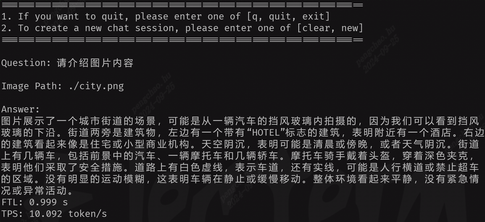

# MiniCPM-V-2_6

本项目实现BM1684X部署语言大模型[MiniCPM-V-2_6](https://huggingface.co/openbmb/MiniCPM-V-2_6)。通过[TPU-MLIR](https://github.com/sophgo/tpu-mlir)编译器将模型转换成bmodel，并采用c++代码将其部署到BM1684X的PCIE环境，或者SoC环境。

## 开发环境准备

#### 1. 从Huggingface下载`MiniCPM-V-2_6`

(比较大，会花费较长时间)

``` shell
git lfs install
git clone git@hf.co:openbmb/MiniCPM-V-2_6
```

另外需要做一些模型源码上的修改：
* 将`compile/files`下的`model_qwen2.py`替换到transformer中的`model_qwen2.py`文件
* 将`compile/files`下的其他文件替换`MiniCPM-V-2_6`中对应的文件。

#### 2. 导出成onnx模型

如果过程中提示缺少某些组件，直接`pip3 install 组件`即可

``` shell
# 导出onnx
cd compile
python3 export_onnx.py --model_path your_minicpmv_path
```

## 编译模型

此处介绍如何将onnx模型编译成bmodel。也可以省去编译模型这一步，直接下载编译好的模型：

``` shell
python3 -m dfss --url=open@sophgo.com:/ext_model_information/LLM/LLM-TPU/minicpmv26_bm1684x_int4.bmodel
```

#### 1. 下载docker，启动容器

``` shell
docker pull sophgo/tpuc_dev:latest

# myname1234 is just an example, you can set your own name
docker run --privileged --name myname1234 -v $PWD:/workspace -it sophgo/tpuc_dev:latest bash

docker exec -it myname1234 bash
```
后文假定环境都在docker的`/workspace`目录。

#### 2. 下载`TPU-MLIR`代码并编译

(也可以直接下载编译好的release包解压)

``` shell
cd /workspace
git clone git@github.com:sophgo/tpu-mlir.git
cd tpu-mlir
source ./envsetup.sh  #激活环境变量
./build.sh #编译mlir
```

#### 3. 编译模型生成bmodel

对ONNX模型进行编译，生成模型`minicpmv26_bm1684x_int4.bmodel`

``` shell
cd compile
./compile.sh
```

## 编译与运行程序

编译库文件，生成`chat.cpython*.so`文件，将该文件拷贝到`pipeline.py`文件目录

```
cd python_demo
mkdir build
cd build && cmake .. && make && cp *cpython* .. && cd ..
```

执行程序，如下：

```
python3 pipeline.py --model_path minicpmv26_bm1684x_int4.bmodel --tokenizer ../support/token_config --devid 0
```
model为实际的model储存路径；tokenizer_path为实际的tokenizer配置的储存路径

* 运行效果



