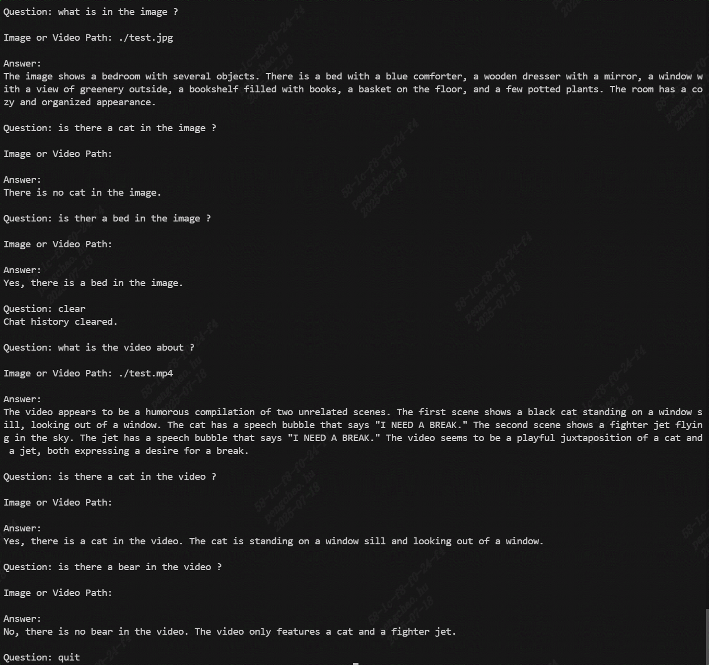

# Qwen2.5-VL

本工程实现BM1684X/BM1688部署多模态大模型[Qwen2.5-VL](https://huggingface.co/Qwen/Qwen2.5-VL-3B-Instruct-AWQ)。通过[TPU-MLIR](https://github.com/sophgo/tpu-mlir)编译器将模型转换成bmodel，并采用c++代码将其部署到PCIE环境，或者SoC环境。

该模型可以用于图片或者视频的识别，有python和cpp两个版本的demo。

本文包括如何编译bmodel，和如何在BM1684X/BM1688环境运行bmodel。如何编译bmodel环节可以省去，直接用以下链接下载：

``` shell
# 1684x 3B 2K,max_pixel 672x896, 视频最长可以支持20s (每秒1帧)
python3 -m dfss --url=open@sophgo.com:/ext_model_information/LLM/LLM-TPU/qwen2.5-vl-3b-instruct-awq_w4bf16_seq2048_bm1684x_1dev_20250428_143625.bmodel
# 1684x 7B 2K,max_pixel 672x896
python3 -m dfss --url=open@sophgo.com:/ext_model_information/LLM/LLM-TPU/qwen2.5-vl-7b-instruct-awq_w4bf16_seq2048_bm1684x_1dev_20250428_150810.bmodel
# 1684x 7B 8K,max_pixel 672x896, 视频最长可以支持80s (每秒1帧)
python3 -m dfss --url=open@sophgo.com:/ext_model_information/LLM/LLM-TPU/qwen2.5-vl-7b-instruct-awq_w4bf16_seq8192_bm1684x_1dev_20250430_115515.bmodel
# 1684x 7B 4K,max_pixel 672x896, 支持历史上下文，最大输入长度是1024
python3 -m dfss --url=open@sophgo.com:/ext_model_information/LLM/LLM-TPU/qwen2.5-vl-3b-instruct-awq_w4bf16_seq4096_bm1684x_1dev_20250717_171504.bmodel


# 1688 3B 2K,max_pixel 672x896
python3 -m dfss --url=open@sophgo.com:/ext_model_information/LLM/LLM-TPU/qwen2.5-vl-3b-instruct-awq_w4bf16_seq2048_bm1688_2core_20250428_144952.bmodel
# 1688 7B 2K,max_pixel 672x896
python3 -m dfss --url=open@sophgo.com:/ext_model_information/LLM/LLM-TPU/qwen2.5-vl-7b-instruct-awq_w4bf16_seq2048_bm1688_2core_20250428_152052.bmodel
```

## 编译LLM模型

此处介绍如何将LLM编译成bmodel。

#### 1. 从Huggingface下载`Qwen2.5-VL-3B-Instruct-AWQ`

(比较大，会花费较长时间)

``` shell
# 下载模型
git lfs install
git clone git@hf.co:Qwen/Qwen2.5-VL-3B-Instruct-AWQ
# 如果是7B，则如下：
git clone git@hf.co:Qwen/Qwen2.5-VL-7B-Instruct-AWQ
```

#### 2. 下载docker，启动容器

``` shell
docker pull sophgo/tpuc_dev:latest

# myname1234 is just an example, you can set your own name
docker run --privileged --name myname1234 -v $PWD:/workspace -it sophgo/tpuc_dev:latest
```
后文假定环境都在docker的`/workspace`目录。

#### 2. 下载`TPU-MLIR`代码并编译

(也可以直接下载编译好的release包解压)

``` shell
cd /workspace
git clone git@github.com:sophgo/tpu-mlir.git
cd tpu-mlir
source ./envsetup.sh  #激活环境变量
./build.sh #编译mlir
```

#### 3. 编译模型生成bmodel

``` shell
# 如果有提示transformers版本问题，pip3 install transformers --upgrade
llm_convert.py -m /workspace/Qwen2.5-VL-3B-Instruct-AWQ -s 2048 --quantize w4bf16  -c bm1684x --out_dir qwen2.5vl_3b --max_pixels 672,896
```

## 编译与运行程序(python)

* 环境准备
> （python_demo运行之前都需要执行这个）
``` shell
# 如果不是python3.10，参考"常见问题"配置环境
pip3 install torchvision pillow qwen_vl_utils transformers>=4.49.0
```

编译库文件，生成`chat.cpython*.so`文件，将该文件拷贝到`pipeline.py`文件目录

``` shell
cd python_demo
mkdir build 
cd build && cmake .. && make && cp *cpython* .. && cd ..

# run demo
python3 pipeline.py -m xxxx.bmodel -c config 
```
model为实际的model储存路径；config_path为配置文件路径

## 编译和运行程序(cpp)

``` shell
cd cpp_demo
mkdir build 
cd build && cmake .. && make && cp pipeline .. && cd ..

# run demo
./pipeline -m xxx.bmodel -c config
```

## 进阶应用

### 支持历史上下文

默认情况下模型是不支持历史上下文，需要加上`--use_block_with_kv`参数；另外需要指定输入最大长度`--max_input_length`，不指定时默认是seq_length的1/4。
如下：
``` shell
# 如果有提示transformers版本问题，pip3 install transformers --upgrade
llm_convert.py -m /workspace/Qwen2.5-VL-3B-Instruct-AWQ -s 4096 --quantize w4bf16  -c bm1684x --out_dir qwen2.5vl_3b --max_pixels 672,896 --use_block_with_kv --max_input_length 1024
```
使用cpp_demo或者python_demo都支持。历史记录输入clear清理。效果如下：



## 常见问题

#### SoC如何配置python3.10环境 ?

安装过程如下：

``` shell
sudo add-apt-repository ppa:deadsnakes/ppa
sudo apt update
sudo apt install python3.10 python3.10-dev
```

python虚拟环境配置：

``` shell
cd /data
# 创建虚拟环境（不包含 pip）
python3.10 -m venv --without-pip myenv

# 进入虚拟环境
source myenv/bin/activate

# 手动安装 pip
curl https://bootstrap.pypa.io/get-pip.py -o get-pip.py
python get-pip.py
rm get-pip.py

# 安装依赖库
pip3 install torchvision pillow qwen_vl_utils transformers --upgrade

```

#### 一张图片占多少Token ?

计算公式 $ token数 = 长 × 宽 ÷ 28 ÷ 28 $
比如672x896尺寸图片占token数为768

#### 视频占多少Token ?

本例中视频尺寸默认为图片的1/4，比如672x896情况下取尺寸336x448，也就是每两帧(`temporal_patch_size`)占192个token。

默认每秒1帧。

20秒视频取20帧，总token数为 $ 192 × 20 ÷ 2 = 1920 $
