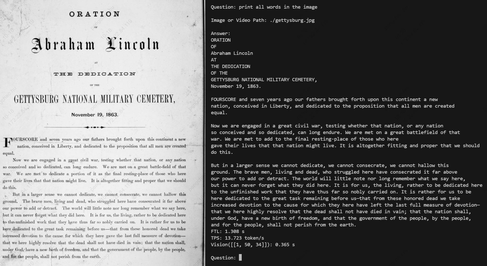

# Qwen3-VL

本工程实现BM1684X/BM1688部署多模态大模型[Qwen3-VL](https://www.modelscope.cn/models/Qwen/Qwen3-VL-4B-Instruct)。通过[TPU-MLIR](https://github.com/sophgo/tpu-mlir)编译器将模型转换成bmodel，并将其部署到PCIE环境，或者SoC环境。

本文包括如何编译bmodel，和如何在BM1684X/BM1688环境运行bmodel。如何编译bmodel环节可以省去，直接用以下链接下载：

``` shell
# =============== 1684x =====================
# 1684x 4B 最大1K输入, max_pixel 768x768
python3 -m dfss --url=open@sophgo.com:/ext_model_information/LLM/LLM-TPU/qwen3-vl-4b-instruct_w4bf16_seq2048_bm1684x_1dev_20251015_145353.bmodel 

```


## 编译LLM模型

此处介绍如何将LLM编译成bmodel。

#### 1. 从ModelScope下载`Qwen3-VL-4B-Instruct`

(比较大，会花费较长时间)

``` shell
# 下载模型
modelscope download --model Qwen/Qwen3-VL-4B-Instruct --local_dir Qwen3-VL-4B-Instruct
```

#### 2. 下载docker，启动容器

``` shell
docker pull sophgo/tpuc_dev:latest

# myname1234 is just an example, you can set your own name
docker run --privileged --name myname1234 -v $PWD:/workspace -it sophgo/tpuc_dev:latest
```
后文假定环境都在docker的`/workspace`目录。

#### 2. 下载`TPU-MLIR`代码并编译

(也可以直接下载编译好的release包解压)

``` shell
cd /workspace
git clone git@github.com:sophgo/tpu-mlir.git
cd tpu-mlir
source ./envsetup.sh  #激活环境变量
./build.sh #编译mlir
```

#### 3. 编译模型生成bmodel

``` shell
# 如果有提示transformers/torch版本问题，pip3 install transformers torchvision -U
# 这里max_input_length指定最大输入长度，如果不指定则为-s指定的长度
llm_convert.py -m /workspace/Qwen3-VL-4B-Instruct  -s 2048 --max_input_length 1024  --quantize w4bf16  -c bm1684x --out_dir qwen3vl_4b  --max_pixels 768,768
```
编译完成后，在指定目录`qwen3vl_4b`生成`qwen3-vl-xxx.bmodel`和`config`

## 编译与运行程序(python)

* 环境准备
> （python_demo运行之前都需要执行这个）
``` shell
# 如果不是python3.10，参考"常见问题"配置环境
pip3 install torchvision transformers
```

编译库文件，生成`chat.cpython*.so`文件，将该文件拷贝到`pipeline.py`文件目录

``` shell
cd python_demo
mkdir build 
cd build && cmake .. && make && cp *cpython* .. && cd ..

# run demo
python3 pipeline.py -m xxxx.bmodel -c config 
```
model为实际的model储存路径；config_path为配置文件路径。

运行效果如下：




## 常见问题

#### SoC如何配置python3.10环境 ?

安装过程如下：

``` shell
sudo add-apt-repository ppa:deadsnakes/ppa
sudo apt update
sudo apt install python3.10 python3.10-dev
```

python虚拟环境配置：

``` shell
cd /data
# 创建虚拟环境（不包含 pip）
python3.10 -m venv --without-pip myenv

# 进入虚拟环境
source myenv/bin/activate

# 手动安装 pip
curl https://bootstrap.pypa.io/get-pip.py -o get-pip.py
python get-pip.py
rm get-pip.py

# 安装依赖库
pip3 install torchvision pillow qwen_vl_utils transformers --upgrade

```

#### 一张图片占多少Token ?

计算公式 $ token数 = 长 × 宽 ÷ 32 ÷ 32 $
比如768x768尺寸图片占token数为576 token

